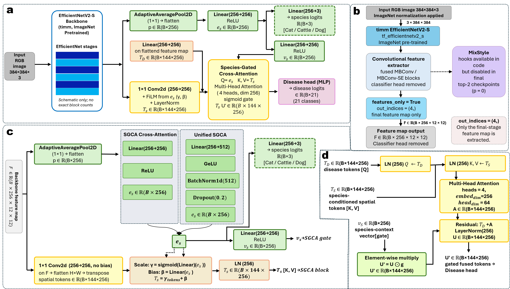
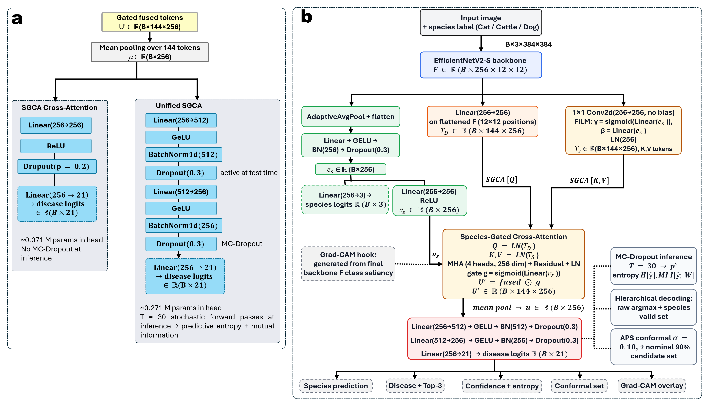
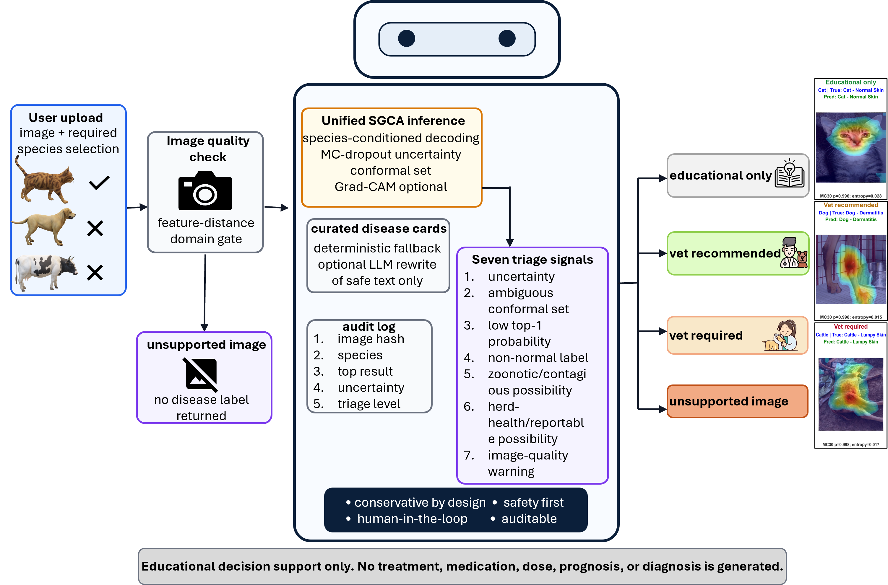

<div align="center">

# Species-Gated Cross-Attention Model

### Multi-species veterinary dermatology classification with uncertainty-aware decision support

[](#installation)
[](#model-architecture)
[](#model-architecture)
[](#scientific-boundary)
[](LICENSE)

**Unified SGCA** combines species-conditioned feature modulation, cross-attention, hierarchical decoding, MC-dropout uncertainty, conformal candidate sets, Grad-CAM support, and a conservative decision-support agent.

</div>

---

## Overview

This repository contains the code and GitHub-ready release artifacts for the **Species-Gated Cross-Attention (SGCA)** veterinary dermatology system described in the accompanying manuscript. The system classifies **21 dermatological categories** across **cats, cattle, and dogs** from RGB images and includes a deployment-oriented decision-support agent.

The agent is designed for image-based screening, ranked educational support, uncertainty-aware triage, and unsupported-image rejection. It is **not** a veterinary diagnosis or treatment-prescription system.

## Highlights

- Species-aware disease classification across cats, cattle, and dogs.
- FiLM-based species conditioning of spatial feature tokens.
- Species-gated cross-attention between disease tokens and species-conditioned spatial tokens.
- Hierarchical species-conditioned decoding to restrict predictions to biologically valid classes.
- Unified SGCA uncertainty layer with MC-dropout, APS conformal candidate sets, and Grad-CAM support.
- Conservative decision-support agent with OOD rejection, triage signals, and disease information cards.

## Model Architecture

### SGCA Architecture



### Disease Heads and Inference Outputs



### Decision-Support Agent Workflow



## Final Manuscript Metrics

| Model | Split | Accuracy | Macro-F1 | ROC-AUC | PR-AUC | Top-3 |
|---|---:|---:|---:|---:|---:|---:|
| Unified SGCA | Validation | 96.5% | 96.6% | 0.999 | 0.988 | 99.0% |
| Unified SGCA | Internal test | 97.5% | 98.0% | 0.999 | 0.993 | 99.6% |
| Unified SGCA | Development external | 79.5% | 81.7% | 0.986 | 0.899 | 93.0% |
| SGCA Cross-Attention | Validation | 96.6% | 96.8% | 0.999 | 0.988 | 99.0% |
| SGCA Cross-Attention | Internal test | 96.9% | 97.4% | 0.999 | 0.993 | 99.5% |
| SGCA Cross-Attention | Development external | 72.8% | 72.8% | 0.977 | 0.846 | 88.8% |

The development-external cohort is an internet-derived robustness cohort. It should not be interpreted as a locked prospective clinical validation set.

## Repository Structure

```text
SGCA-main/
├── assets/architecture/          Architecture and workflow panels for the README
├── data/                         Data access notes; raw images are not included
├── notebooks/                    Publication training and comparison notebooks
├── results/
│   ├── agent/                    Summary agent and OOD evaluation outputs
│   └── models/                   Final checkpoints and training histories
├── scripts/                      Evaluation and reproducibility scripts
├── sgca/                         Core SGCA model definitions and utilities
├── vetderm_agent/                Prototype decision-support agent
├── LICENSE
├── MODEL_CARD.md
├── README.md
├── REPRODUCE.md
└── requirements.txt
```

## Installation

Create a Python environment and install the dependencies:

```bash
pip install -r requirements.txt
pip install -r vetderm_agent/requirements_agent.txt
```

CUDA is recommended for full evaluation and MC-dropout inference. CPU execution is suitable for inspecting code and running lightweight smoke tests.

## Checkpoints

The final model weights are included in this release folder:

```text
results/models/unified_sgca/unified_sgca_best.pt
results/models/sgca_cross_attention/sgca_cross_attention_best.pt
```

The Unified SGCA checkpoint is the dog-normal robustness fine-tuned checkpoint used for the updated manuscript results. The two checkpoint files are approximately 80 MB each.

## Data Availability

Raw images, per-image prediction files, probability arrays, dataset manifests, checksums, full figure source tables, and manuscript result figures are **not included** in this initial GitHub-ready release. They are archived separately and can be released later through an approved data package or repository release.

Expected local data layout for full reproduction after data access is granted:

```text
data/training_data_deduped_splits/seed42/
  train/
  val/
  test/

data/development_external_2026_05_02/
  Cat/
  Cattles/
  Dog/
```

The internal folder name `Cattles` is retained for checkpoint compatibility; manuscript-facing text uses `Cattle`.

## Reproducibility

The notebooks under `notebooks/` provide the publication training and comparison workflow:

```text
notebooks/train_unified_sgca.ipynb
notebooks/train_sgca_cross_attention.ipynb
notebooks/compare_final_models.ipynb
```

Additional details are provided in [REPRODUCE.md](REPRODUCE.md).

## Agent Evaluation

Summary outputs for the MC30 decision-support agent and OOD stress test are included under:

```text
results/agent/triage_mc30/
results/agent/ood_domain_gate_mc30/
```

The final OOD stress test rejected 225/225 general-photograph uploads as unsupported images. This evaluates clearly unsupported general photographs and does not establish complete safety for all near-OOD veterinary edge cases.

## Scientific Boundary

This project is a research and educational decision-support prototype. The system does not provide drug names, dosage guidance, treatment plans, prognosis, or definitive diagnostic statements. Veterinary review remains necessary, especially for zoonotic, contagious, herd-health, uncertain, or low-quality submissions.

## Citation

If you use this repository, please cite the accompanying manuscript when available.

```bibtex
@article{sgca_vetderm_2026,
  title   = {Species-Gated Cross-Attention for Multi-Species Veterinary Dermatology Classification and Decision Support},
  author  = {Afkaar, Shafiq and collaborators},
  journal = {Manuscript under review},
  year    = {2026}
}
```

## License

This repository is released under the [Apache License 2.0](LICENSE).
